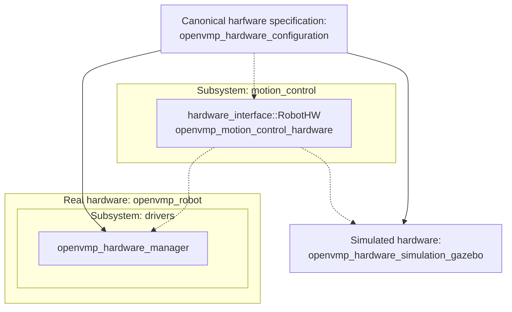

# OpenVMP

## Package for robot hardware specifications

Each OpenVMP robot has its hardware specifics detailed in a configuration file.
See [an example](../openvmp_robot_don1/config/hardware.yaml).

This package implements a parser and a container for such hardware configuration information.

This package is used in both
[simulation](../openvmp_hardware_simulation_gazebo/README.md) and
[runtime](../openvmp_hardware_manager/README.md) environments:

